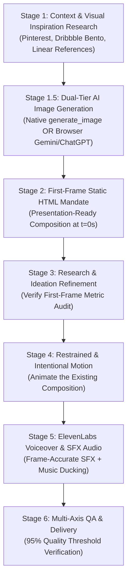

# Optimized Motion Reel Production Workflow

## Operational Philosophy
A SaaS motion reel is not a slideshow, nor is it raw visual noise. High-end motion design—as practiced by Apple, Linear, Raycast, Stripe, Cron, and Framer—relies on **restraint, tactile physics, living software in action, and acoustic synchronization**.

This protocol defines the end-to-end production pipeline spanning 5 core disciplines:
1. **Creative Director**: Narrative arc, emotional velocity, reference curation, and pacing.
2. **Frontend Visual Designer**: First-frame static HTML perfection, typography scale, depth, and glassmorphism.
3. **Senior Motion Designer**: Restrained physics, cubic-bezier curves, cursor choreography, and kinetic typography.
4. **Sound Designer**: ElevenLabs voiceover synthesis, 120-128 BPM soundtrack selection, and micro-timed SFX.
5. **AI Production Director**: Multi-axis QA verification, 95% threshold gatekeeping, and automated rendering.

---

## The Optimized 7-Stage Production Pipeline



---

## Stage 1: Context & Visual Inspiration Research
Before writing any code or composition:
1. **Deconstruct the Product**:
   - Extract the core user promise (e.g. FocusFlow: "Eliminate cloud friction and distraction").
   - Identify the single hero action (e.g. typing a task, clicking start, completing an item).
   - Identify the payoff metric (e.g. +150 XP, zero cloud latency, instantaneous save).
2. **Visual Inspiration Mining**:
   - **Pinterest & Dribbble Bento Grids**: Asymmetrical tile balance, 2x2 hero card with 1x1 accessory badges, unified corner radii (16px–24px), 1px gradient borders (`rgba(255,255,255,0.12)`).
   - **Dark Mode Elevation Palette**:
     - Void Background: `#05070B` or `#090D16`
     - Card Surface: `#0E131F` with `backdrop-filter: blur(20px)`
     - Accent Energy: High-voltage orange (`#FF6B00`), Emerald (`#10B981`), or Electric Blue (`#3B82F6`)
   - **Typography Foundations**:
     - Display: Inter Tight, Space Grotesk, Plus Jakarta Sans (tracking -0.03em, line-height 1.05)
     - Data/Mono: JetBrains Mono, Fira Code (all caps, letter-spacing 0.08em)
     - Hierarchy Contrast: Minimum 5x scale between micro-labels (10px–12px) and hero headlines (64px–80px).

---

## Stage 1.5: Dual-Tier AI Image Asset Generation (Native Tools & Browser AI)
When a scene requires bespoke visual imagery—such as 3D hardware device mockups, isometric glassmorphic badges, cosmic dark-mode background meshes, or photorealistic product podiums—the system uses a **Dual-Tier Image Generation Protocol**:

### Tier 1: Direct Agent Tool Generation (`generate_image`)
- If image generation limits and native tools are available, call `generate_image` directly.
- Specify exact aspect ratios (`9:16`, `16:9`, `1:1`, etc.) and art-directed prompts emphasizing cinematic octane rendering, glass refraction, and dark-mode lighting.
- Saves the generated asset directly to the workspace or brain artifact directory.

### Tier 2: Autonomous In-Browser AI Generation (Gemini & ChatGPT)
- If native tool limits are reached, or when complex multi-modal image synthesis (e.g. Imagen 3, DALL-E 3) produces superior art direction:
  - Autonomously open Chrome DevTools and navigate to **Google Gemini** (`https://gemini.google.com/app`) or **ChatGPT** (`https://chatgpt.com`).
  - Enter structured, art-directed image prompts using standardized templates from `scripts/image_asset_manager.js`.
  - Extract the generated high-resolution image asset directly from the browser DOM or download it into `assets/images/` or the scene directory.
- All generated images undergo preflight validation (`ImageAssetManager.prototype.verifyAsset`) before being bound into the first-frame HTML composition.

### Master Cinematic Realism Vibe Prompt (Image-to-Image / Asset Enhancement)
When taking any base photo, 3D render, customer testimonial, or UI mockup and upgrading it to high-end cinematic realism, use this master directive:
```text
Enhance the provided image into an emotionally powerful, cinematic, ultra-realistic 4K photograph while preserving the existing design, layout, composition, subject placement, and intent exactly.

Inject extraordinary positive emotion, warmth, human connection, and cinematic intensity. Make the image feel like an unforgettable frame from a high-end film, with breathtaking composition, dynamic perspective, layered depth, rich texture, authentic imperfections, and refined cinematic colour grading.

Keep the primary subject crystal-clear and tack-sharp. NO motion blur, softness, ghosting, or focus loss on the primary subject. Subtle motion blur is allowed only on appropriate background or secondary moving elements.

Introduce subtle real-world photographic imperfections: slight handheld character, natural micro-movement, realistic texture variation, gentle optical falloff, subtle photographic grain, believable environmental imperfections, and candid visual energy. Keep everything restrained and physically plausible.

Use subtle sunlight, restrained bloom, shallow foreground/background depth blur, directional key light from the upper left, and slightly deeper shadows on the opposite side for dimensional cinematic contrast.

Naturally warm skin tones. Enhance eye sharpness, iris detail, catchlights, micro-contrast, pores, beard detail, and skin texture while preserving authentic anatomy.

Preserve every important visual detail exactly. Do not redesign, reposition, simplify, restructure, or add unnecessary elements. EDIT ONLY.

Upscale and refine the final result to true 4K Ultra HD while preserving natural photographic detail.

Final result: emotionally extraordinary, lively, cinematic, candid, physically believable, professionally photographed, and unmistakably real rather than AI-perfect.
```

### Optical Rules Applied to Motion Scenes (Anti-AI Plasticity):
1. **Directional Key Light**: Always illuminate UI cards and 3D assets with soft key light from the upper-left (`top: -10%, left: -10%`), casting directional ambient occlusion shadows downward and rightward.
2. **Subtle 35mm Photographic Grain**: Apply an SVG micro-noise overlay (`opacity: 0.035; mix-blend-mode: overlay`) over dark backgrounds (`#05070B`) to kill gradient banding and eliminate synthetic digital flatness.
3. **Tack-Sharp Primary Subject**: Never apply global blurs or muddy filters to the hero interface or typography. Only background particles, ambient glows, or defocused accessory cards receive shallow depth blur.
4. **Preserve Geometry Exactly (EDIT ONLY)**: Never let generative enhancements alter established UI button positions, typography hierarchy, or data points.

---

## Stage 2: First-Frame Static HTML Composition Mandate
> **THE LAW OF FIRST FRAME PERFECTION**:
> Never author animation on an empty canvas. Every scene MUST exist first as a complete, static, presentation-grade HTML graphic design at `t = 0.0s`. If you screenshot frame 0 and place it in a design portfolio, it must look finished and award-worthy.

### Execution Standards for Frame 0:
1. **Canvas Specifications**:
   - Resolution: 1080×1920 (9:16 vertical reels) or 1920×1080 (16:9 widescreen).
   - Viewport scaling: Locked at 1.0 device scale factor with zero responsive squishing.
2. **Layering & Depth Stack**:
   - *Layer 0 (Background)*: Radial glow gradient centered behind focal elements (`radial-gradient(circle at 50% 40%, rgba(255,107,0,0.15) 0%, transparent 70%)`).
   - *Layer 1 (Subtle Grid/Gridlines)*: Utilitarian dot grid or millimeter crosshairs at 5% opacity.
   - *Layer 2 (Environment/Context)*: App window chrome, traffic light dots, status bar.
   - *Layer 3 (Hero Product Surface)*: 2.5D perspective tilt (`perspective: 1400px; transform: rotateX(8deg) rotateY(-4deg)`), deep contact drop shadow (`box-shadow: 0 40px 80px -15px rgba(0,0,0,0.7)`).
   - *Layer 4 (Interactive Cursor & Badges)*: SVG pointer, floating toasts, XP pills.
3. **Automated Audit**:
   - Run `node scripts/verify_first_frame.js <scene.html>` to verify font contrast, glassmorphic card count, and surface elevation before proceeding to animation.

---

## Stage 3: Research & Ideation Refinement
Before moving to motion, compare the captured static frame against references:
- **Second-Read Details**: Are there micro-details that reward close inspection? (e.g., keyboard shortcuts `⌘K`, latency badges `< 1ms`, live status dots `● LOCAL CACHE ACTIVE`).
- **Contrast & Legibility**: Does the eye immediately snap to the hero focal point within 200ms?
- **Restraint Check**: Eliminate unnecessary cards or badges that do not serve the story.

---

## Stage 4: Restrained & Intentional Motion Choreography
> **THE LAW OF IN-PLACE ANIMATION**:
> Animate the existing composition. Never dismantle or swap out the DOM elements that made frame 0 beautiful.

### Motion Design Rules:
1. **Cubic-Bezier Acceleration**:
   - Discard linear and generic ease-in-out curves.
   - Standard Entry: `cubic-bezier(0.16, 1, 0.3, 1)` (snappy acceleration, soft settling).
   - Micro-Haptics: `cubic-bezier(0.34, 1.56, 0.64, 1)` (slight elastic overshoot for buttons and badges).
2. **Cursor Choreography**:
   - Realistic deceleration: Mouse moves faster over distance and glides to a stop at the target button.
   - Physical click feedback: Button dips `transform: scale(0.95)`, cursor scales `scale(0.88)` for 120ms, radial haptic ripple emits from click origin.
3. **Kinetic Typography**:
   - Staggered line/word reveals wrapped in `overflow: hidden`.
   - Never fade text from 0% opacity alone; slide from `translateY(110%)` to `0%` with crisp easing.
4. **Camera & Parallax**:
   - Gentle continuous Z-axis push-in (`scale: 1.0` to `1.04` over 3.0s) to keep visual energy alive without causing motion sickness.

---

## Stage 5: ElevenLabs Voiceover & Master Audio Engineering
Audio is 50% of the perceived production value. Silent or poorly mixed video feels amateur regardless of animation quality.

### 1. ElevenLabs Voiceover Pipeline:
- Script authoring: Punchy, active voice. 15–20 words per 5 seconds maximum.
- Voice selection:
  - `LIAM` (`TX3LPaxmHKxFdv7VOQHJ`): High-energy, crisp SaaS product launches.
  - `BRIAN` (`nPczCjzI2devNBz1zWvd`): Authoritative, deep cinematic enterprise trailers.
  - `EMILY` (`LcfcDJNUP1GQjkzn1xUU`): Modern, articulate product walkthroughs.
- Script synthesis via `scripts/generate_voiceover.js`.

### 2. Sound Design & SFX Cue Synchronization:
- Background music: 120–128 BPM electronic or lo-fi groove.
- Ducking envelope: Attenuate background music volume by -6dB during voiceover playback.
- SFX Cue Sheet (`SoundDesigner`):
  - Every UI click must trigger a crisp interface tick (`click_002.ogg`).
  - Every destructive purge must trigger a resonant glass/metal impact (`impactGlass_medium_000.ogg`).
  - Every keystroke burst must trigger mechanical switch clacks (`keypress-001.wav`).
  - Every task completion must trigger a haptic snap (`switch_001.ogg`) + harmonic chime (`drop_001.ogg`).
  - Compile master audio with `scripts/sound_designer.js`.

---

## Stage 6: Multi-Axis Visual & Audio QA Gate
Before delivering any video, the production pipeline enforces a strict 95% quality verification:

| Checkpoint | Requirement | Pass Condition |
| :--- | :--- | :--- |
| **First Frame Quality** | Presentation-ready HTML layout | Passed `verify_first_frame.js` with typography ratio ≥ 4.0x |
| **Living Software** | Zero static slides | Product shown in active use with cursor and real state change |
| **Animation Smoothness** | 30 FPS / 60 FPS deterministic capture | Zero frame stutter or dropped ticks |
| **Audio Sync** | Visual action to SFX delta | SFX cue aligned within ±33ms (1 frame) of visual trigger |
| **Audio Mix** | Loudness and clarity | Music ducked beneath voiceover; zero clipping or distortion |
| **Visual QA** | Color variance & luminance | All milestone frames pass `VisualInspector` (no black frames) |

---

## Tooling Reference

```bash
# 1. Audit static first-frame composition
node scripts/verify_first_frame.js <scene.html>

# 2. Synthesize ElevenLabs voiceover
node -e "import('./scripts/generate_voiceover.js').then(m => m.generateVoiceover({ text: '...', outputPath: 'assets/vo.mp3' }))"

# 3. Compile master sound design (music + SFX + VO)
node -e "import('./scripts/sound_designer.js').then(m => new m.SoundDesigner().buildMasterTrack(cueSheet, 'assets/master.wav'))"

# 4. Render deterministic video
node scripts/render.js --scene <scene.html> --output render-tests/video.mp4 --fps 30 --duration 10.0 --width 1080 --height 1920

# 5. Mux audio and video
ffmpeg -y -i render-tests/video.mp4 -i assets/master.wav -c:v copy -c:a aac -b:a 192k -shortest final-reel.mp4
```
