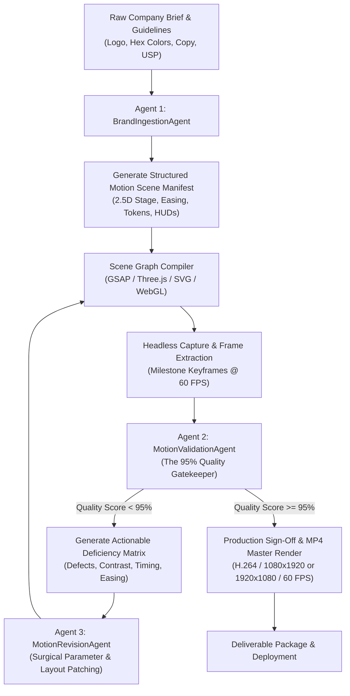

# Motion Studio Enterprise 🎬

> **Autonomous AI-Driven SaaS Motion Graphics Production Engine**  
> Converts natural language company briefs into agency-tier, 100% deterministic, high-tech motion graphics with an autonomous **95% Professional Quality Gatekeeper Loop**.

---

## Architecture & Specialized Agent Fleet

Motion Studio decouples creative planning, design systems, visual runtimes, and automated quality assurance into independent, autonomous agents:



### 1. `BrandIngestionAgent` (Understanding & Processing)
- Ingests company brand assets (vector logos, primary/secondary palettes, typography scales, USP copy, proof points).
- Infers industry visual archetypes (`Ethereal_Glass` for AI/DevTools, `Precision_Steel` for FinTech/Enterprise, `Modern_Warm` for Consumer/Logistics).
- Replaces amateur emojis with crisp, high-DPI inline vector SVG line glyphs.
- Synthesizes design tokens and outputs an immutable `MotionSceneManifest`.

### 2. `MotionValidationAgent` (The 95% Quality Gatekeeper)
- Audits output against **8 professional SaaS motion design pillars**:
  1. **Spatial Staging & Double-Bezel Hierarchy** (15%): Doppelrand nested hardware frames, concentric corner radii.
  2. **Kinematics & Easing Smoothness** (15%): High-order `cubic-bezier(0.16, 1, 0.3, 1)` or calibrated spring physics. Zero linear easing.
  3. **Chromatic Atmosphere & Dark-Mode Mesh** (15%): Multi-point radial gradient meshes over OLED black, 8-bit film grain anti-banding.
  4. **Typographic Hierarchy & Stagger Mechanics** (15%): Masked split-text reveals, negative tracking contraction, monospace tabular numbers.
  5. **Iconography & Asset High-DPI Fidelity** (10%): Strict ban on unicode emojis; high-DPI vector glyphs only.
  6. **High-Tech SaaS Motifs** (10%): 2.5D perspective tilt, telemetry HUD pills, laser border traces.
  7. **Frame Determinism & Virtual Time Stepping** (10%): 100% zero-pixel-drift under forward and backward seek cycles.
  8. **Brand Identity & Ground-Truth Lockdown** (10%): Verified contact records, authentic primary color dominance.
- **The 95% Hard Gate**: If the aggregate score is below $95.0\%$, the composition is rejected and routed to the Revision Agent with a structured **Deficiency Matrix**.

### 3. `MotionRevisionAgent` (Iterative Enhancements)
- Programmatically consumes the Deficiency Matrix.
- Executes surgical patches on easing curves, spatial coordinates, gradient meshes, SVG glyphs, and typography timing.
- Loops back to the Validation Agent until the $\ge 95\%$ benchmark is surpassed.

---

## Documentation & Design Bibles

- 📖 **[SaaS Motion Design Bible & Fault Analysis](docs/SAAS_MOTION_DESIGN_ANALYSIS.md)**: Deep dive into the 12 Immutable Laws of high-end SaaS motion graphics, mathematical easing curves, and fault post-mortems.
- 🛠️ **[GitHub Resources & AI Agent Setup Guide](docs/GITHUB_RESOURCES_AND_AGENT_SETUP.md)**: Open-source repository catalog, installation scripts, and universal brand onboarding schema.
- 📐 **[System Architecture](architecture/SYSTEM_ARCHITECTURE.md)**: Capability-based multi-runtime composition engine.

---

## Quick Start & CLI Usage

### 1. Install Dependencies
```bash
pnpm install
# Or: npm install
```

### 2. Run the Autonomous Multi-Agent Production Loop
To run the autonomous workflow on any company brand intake file:
```bash
node tools/autonomous_workflow.js --brand examples/brands/apexcloud-ai.json --output examples/compiled/apexcloud-ai-launch --threshold 95.0
```

### 3. Run the Comprehensive Test Suite
```bash
# Runs determinism, render pipeline, visual QA, reel determinism, and multi-agent workflow tests
npm test
```

### 4. Render Headless 60 FPS MP4 Video
```bash
node scripts/render.js --scene examples/compiled/apexcloud-ai-launch/index.html --output render-tests/apexcloud-ai.mp4 --fps 60 --duration 20.0 --width 1080 --height 1920
```

---

## Directory Layout

```
motion-studio/
├── docs/
│   ├── SAAS_MOTION_DESIGN_ANALYSIS.md   # SaaS Motion Design Bible & Fault Analysis
│   └── GITHUB_RESOURCES_AND_AGENT_SETUP.md # Open-source repo catalog & agent guide
├── src/
│   ├── agents/
│   │   ├── BrandIngestionAgent.js        # Brand onboarding & token synthesizer
│   │   ├── MotionValidationAgent.js      # 95% Quality Gatekeeper
│   │   ├── MotionRevisionAgent.js        # Surgical defect resolver
│   │   └── Orchestrator.js               # Autonomous loop controller
│   ├── schema/
│   │   ├── BrandIntakeSchema.js          # Brand questionnaire schema validator
│   │   └── validator.js                  # Scene manifest validator
│   ├── compiler/
│   │   └── compiler.js                   # Dual-target scene graph compiler
│   └── engine/
│       ├── renderer.js                   # Headless Chrome + FFmpeg pipe
│       └── inspector.js                  # Computer vision snapshot inspector
├── examples/
│   ├── brands/
│   │   └── apexcloud-ai.json             # Example high-tech SaaS company intake
│   └── compiled/
│       └── apexcloud-ai-launch/          # Compiled 100% approved composition
├── tools/
│   ├── autonomous_workflow.js            # CLI runner for autonomous multi-agent loop
│   └── qa_feedback_loop.py               # Shining Technologies 5-gate visual QA
└── tests/
    └── autonomous-workflow.test.js       # Multi-agent loop & 95% gate unit tests
```
