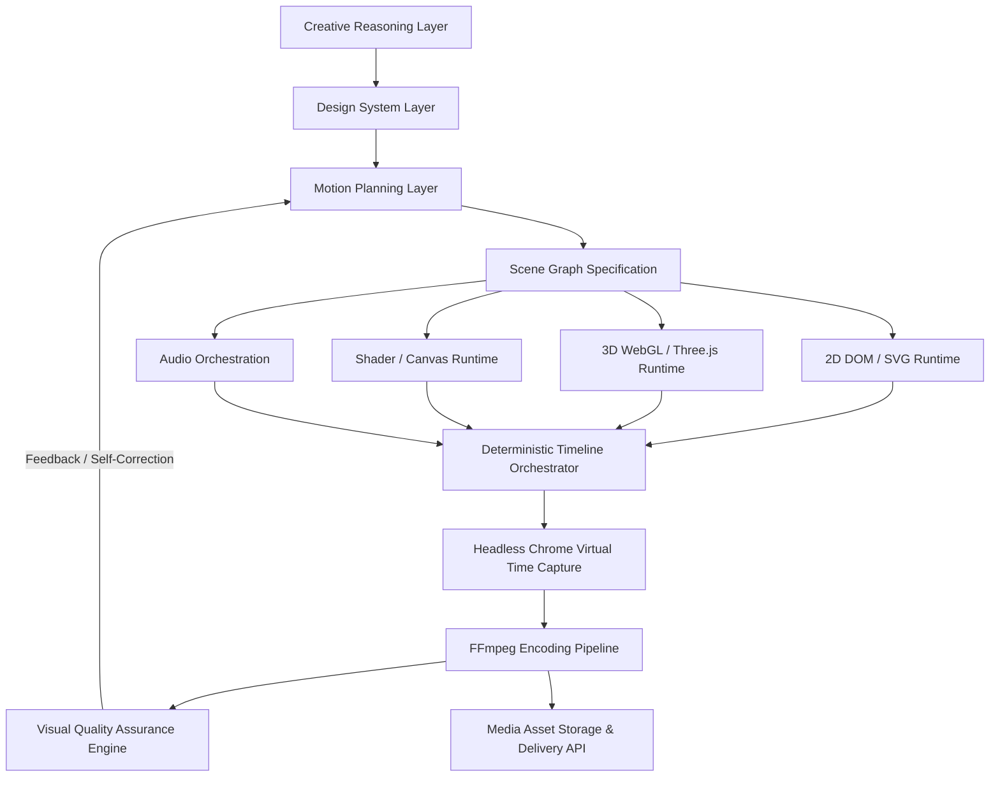
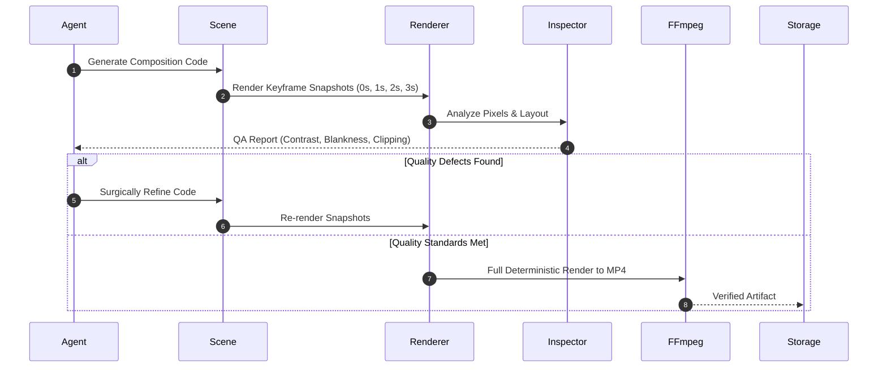

# Motion Studio — System Architecture

**Document Status**: Founding Architectural Baseline  
**Version**: 1.0.0  
**Authors**: Founding Architect & Autonomous Engineering Agent  
**Target**: AI-Driven Deterministic Motion Graphics SaaS Platform  

---

## 1. Executive Summary & Core Objective

Motion Studio is an extensible, capability-based motion graphics engine designed to transform natural language creative briefs into high-fidelity, deterministic, inspectable, editable, and renderable motion graphics.

Traditional video production architectures conflate creative intent, timeline state, layout, and rendering into monolithic video editing files or non-deterministic canvas loops. Motion Studio breaks this model completely by establishing:
1. **Declarative & Inspectable State**: Every scene, timeline beat, and visual element is expressed in transparent, text-based structures (HTML, CSS, SVG, WebGL/Three.js, JSON manifests, and design tokens).
2. **Deterministic Time Virtualization**: Clock time (`Date.now()`, `performance.now()`, `requestAnimationFrame`) is strictly decoupled from animation progress. Timelines are seekable functions of virtual time (`t`), guaranteeing byte-identical, jitter-free rendering regardless of machine load.
3. **Multi-Runtime Composition**: Visual elements execute in their optimal runtime—GSAP for 2D kinetic typography and DOM layout; Three.js for 3D procedural scenes and spatial lighting; SVG/Canvas for procedural vector mathematics; and GLSL for post-processing shaders.

---

## 2. Decoupled Capability Layers

The architecture explicitly rejects monolithic design in favor of 16 decoupled capability layers that can evolve independently:



### Layer Breakdown
1. **Creative Reasoning**: Deconstructs briefs, extracts hierarchy, intent, mood, and brand narrative.
2. **Design System Reasoning**: Resolves brand tokens, palette contrast, typography scales, safe zones, and spatial rhythm.
3. **Motion Design Knowledge**: Enforces motion design principles (timing, spacing, anticipation, easing curves, visual restraint).
4. **Scene Planning**: Organizes storyboard sequences, visual transitions, entrance/exit beats, and visual focus zones.
5. **Asset Generation**: Synthesizes SVG paths, procedural geometric meshes, materials, and typographic layouts.
6. **2D Rendering Runtime**: Orchestrates DOM, CSS transforms, and SVG shapes via seekable timelines (GSAP / Web Animations).
7. **3D Rendering Runtime**: Builds procedural Three.js scenes, camera rigs, lighting hierarchies, glassmorphic shaders, and geometry.
8. **Timeline Orchestration**: Coordinates multi-runtime synchronization through a unified seekable contract (`window.seek(t, frame)`).
9. **Media Pipeline**: Ingests, normalizes, and encodes video streams via headless Chrome DevTools protocol and FFmpeg.
10. **Audio & Reactive Motion**: Analyzes audio transients, RMS energy, and frequency bins to drive keyframed motion parameters.
11. **Composition & Layout**: Manages viewport coordinates, aspect ratios (16:9, 9:16, 1:1), depth stacking, and responsive scaling.
12. **Deterministic Rendering Service**: Frame-accurate, headless capture worker producing high-bitrate MP4/ProRes outputs.
13. **Visual Quality Assurance (VQA)**: Automated snapshot inspection detecting blank frames, clipping, contrast failures, and timing defects.
14. **Storage & Caching Layer**: Content-addressed asset caching, scene manifest versioning, and render cache.
15. **API & Orchestration Interface**: REST/WebSocket endpoints for generation jobs, status updates, and interactive timeline seeking.
16. **Agent Collaboration System**: Autonomous subagents (Creative Director, Motion Designer, 3D Specialist, QA Inspector, Render Worker).

---

## 3. The Deterministic Rendering Contract

Traditional browser rendering depends on the refresh rate and CPU/GPU scheduling. In Motion Studio, rendering is strictly deterministic:

### The Virtual Time Interface
Every renderable scene must expose:
```javascript
window.renderFrame = function(timeInSeconds, frameIndex) {
  // 1. Advance 2D timelines
  // 2. Advance 3D procedural scenes and cameras
  // 3. Update shaders with uniform float u_time
  // 4. Force synchronous render pass
  // Returns true when frame is ready for capture
  return true;
};
```

### Strict Environmental Invariants
- **No Wall-Clock Timing**: Calls to `Date.now()`, `performance.now()`, or unpaused `setTimeout` are banned in composition code.
- **Seeded Pseudo-Randomness**: All procedural effects (particle distributions, floating drift, noise textures) must use a deterministic PRNG seeded per scene (e.g., Mulberry32).
- **Asset Preloading Guarantee**: The renderer must await `document.fonts.ready` and all texture/image loads before advancing `t=0`.
- **Zero Frame Drops**: The headless browser captures frame $N$, captures the buffer, pipes it to FFmpeg, and only then advances to frame $N+1$.

---

## 4. Intermediate Scene Representation (ISR)

Motion Studio decouples creative planning from runtime code via a declarative Scene Graph JSON format:

```json
{
  "$schema": "https://motionstudio.ai/schemas/scene-v1.json",
  "id": "scene-launch-01",
  "meta": {
    "title": "SaaS Product Reveal",
    "duration": 5.0,
    "fps": 60,
    "dimensions": { "width": 1920, "height": 1080 }
  },
  "brand": {
    "colors": {
      "background": "#07090e",
      "primary": "#3b82f6",
      "accent": "#60a5fa",
      "surface": "rgba(255, 255, 255, 0.05)",
      "text": "#f8fafc"
    },
    "typography": {
      "headlineFont": "Inter, sans-serif",
      "bodyFont": "Inter, sans-serif"
    }
  },
  "timeline": [
    {
      "id": "beat-01-intro",
      "start": 0.0,
      "duration": 2.0,
      "runtime": "2d",
      "layer": "typography",
      "action": "kinetic-reveal",
      "params": {
        "text": "Automate Motion Design",
        "stagger": 0.05,
        "easing": "power3.out"
      }
    },
    {
      "id": "beat-02-podium",
      "start": 1.0,
      "duration": 4.0,
      "runtime": "3d",
      "layer": "stage",
      "action": "podium-reveal",
      "params": {
        "cameraPan": [0, 1.2, 4],
        "cameraTarget": [0, 0, 0],
        "roughness": 0.15,
        "transmission": 0.9
      }
    }
  ]
}
```

---

## 5. Visual Quality Assurance (VQA) Feedback Loop

An animation is never marked complete simply because a process exited with code 0. Motion Studio implements an automated visual QA loop:



---

## 6. Licensing & Commercial Suitability

All dependencies must adhere to strict commercial SaaS clearance:
| Dependency | License | Role in Motion Studio | Commercial SaaS Clearance |
| :--- | :--- | :--- | :--- |
| `hyperframes` | Apache-2.0 | Reference & Deterministic Composition CLI | Fully Approved |
| `three` | MIT | 3D WebGL / Shader / Procedural Geometry | Fully Approved |
| `puppeteer-core` | Apache-2.0 | Headless Chrome Automation & Frame Piping | Fully Approved |
| `ffmpeg` | GPL/LGPL (binary) | External Video Encoder on System PATH | Fully Approved (CLI pipe boundary) |
| `gsap` | Standard 'No Charge' | 2D Motion Orchestrator | Approved for internal render; abstractable interface |

---

## 7. Evolution Milestones
- **Phase 1 (Completed & Accepted)**: Scaffolding, architecture baseline, learning registry, operating rules, 18 agent skills, deterministic laboratory spike with verified 2D and 3D scenes (0-pixel drift).
- **Phase 2 (Completed Baseline)**: Declarative Motion Scene Schema, Design Token layer, Component Registry (13 primitives across 2D and 3D), Scene Graph Compiler, 7 canonical benchmarks, 5 parameter-driven variants (3 aspect ratios), ADR-004 HyperFrames integration, and enhanced multi-metric Visual QA.
- **Phase 3**: Parameterized brand and template engine with automated visual theme adaptation.
- **Phase 4**: Autonomous agentic generation loop (Brief $\rightarrow$ Plan $\rightarrow$ Render $\rightarrow$ Inspect $\rightarrow$ Correct).
- **Phase 5**: SaaS production infrastructure (Worker queues, storage, API, web studio UI).

---

## 8. Phase 2 Architecture: Declarative Scene Graph & Component System

Phase 2 transitions Motion Studio from hand-authored laboratory scenes to a generative, declarative motion graphics system.

### 8.1 Motion Scene Schema & Validator (`src/schema/`)
- Strict JSON specification enforcing canvas metadata, timing constraints, non-overlapping or layered tracks, and validated component parameters.
- Schema validation guarantees parameter types, timing sanity (`duration > 0`, `start >= 0`), and unique element IDs before compilation.

### 8.2 Design Token System (`src/tokens/`)
- Hierarchical token cascade: Canvas Defaults $\rightarrow$ Brand Theme Preset (`modern-saas`, `cyber-neon`, `minimal-mono`, `warm-creative`, `luxury-dark`) $\rightarrow$ Scene Overrides $\rightarrow$ Component Overrides.
- Adaptive typography scales, surface treatments, lighting presets, and 3D camera configs calculated contextually based on canvas aspect ratio.

### 8.3 Component Registry (`src/components/`)
13 production-grade primitives categorized by runtime:
- **2D DOM / GSAP (`src/components/2d/`)**:
  - `TextReveal`: Kinetic headline reveal with staggered words/characters and gradient accents.
  - `BrandBadge`: Glassmorphic pill badge with glowing dot and tracked label.
  - `MetricCounter`: Deterministic numeric counter with tabular figures and suffix tags.
  - `SurfaceCard`: Glassmorphic floating backdrop card with border glows.
  - `LogoReveal`: Minimal geometric SVG logo mark with rotational spin-in and pulse.
  - `ShapeReveal`: Abstract decorative SVG geometry (rings, diamonds, hexagon outlines).
- **3D WebGL / Three.js (`src/components/3d/`)**:
  - `PodiumStage`: Circular pedestal with ambient rim lighting and ground reflector.
  - `ProceduralArtifact`: Seeded mathematical icosahedron/torus with metallic wireframes.
  - `LightingRig`: Deterministic three-point studio lighting with key, fill, and color rim lights.
  - `OrbitalCamera`: Deterministic camera orbit and smooth dolly-in.
  - `ParticleField`: Seeded particle cloud floating deterministically via virtual time.
  - `GlassSurface`: Floating translucent glass slab with ACES tone mapping.
  - `ProductCard`: 3D floating tilted product slate displaying SaaS UI elements.

### 8.4 Scene Graph Compiler (`src/compiler/`)
- Compiles declarative JSON manifests into dual-compatible standalone HTML compositions.
- Generates HyperFrames track annotations (`data-composition-id`, `data-track-index`, `data-start`, `data-duration`) and attaches GSAP timelines to `window.__timelines`.
- Implements the universal deterministic seek hook `window.renderFrame(timeInSeconds, frameIndex)` coordinating GSAP and Three.js passes.
- Computes relative asset paths (`relToRoot`) dynamically to support arbitrarily nested output directories.

### 8.5 Visual Quality Assurance Engine (`src/engine/inspector.js`)
Enhanced multi-metric frame evaluation:
- Global and 4-quadrant luminance balance checking.
- Safe-area margin compliance (detecting unwanted text clipping at outer 10% bounds).
- Color diversity and dynamic range analysis.
- Frame-to-frame delta discontinuity analysis detecting visual pop-in or freezing.
