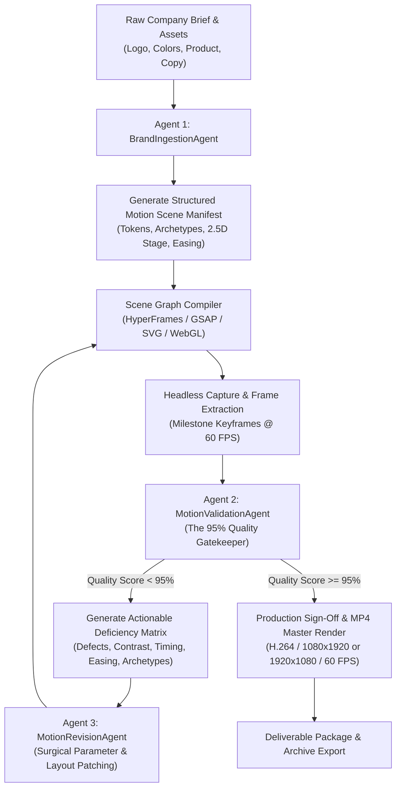

# SaaS Motion Graphics: Technical Fault Analysis & Visual Design Bible

## Executive Summary
This document provides a first-principles architectural breakdown of what differentiates amateur web animations from **elite, high-converting $50,000+ SaaS motion graphics** (as produced by industry benchmarks like Linear, Stripe, Apple, Raycast, Framer, and Ramp). It identifies the specific structural, aesthetic, and mechanical failures of basic DOM-based video generation and defines the definitive engineering guidelines, mathematical easing models, shader pipelines, and visual techniques required for production-grade motion systems.

---

## 1. Deep Fault Analysis: Why Amateur AI-Generated Motion Graphics Fail

When analyzing basic DOM/CSS video generators, their output consistently fails to pass professional scrutiny (scoring below 10–20% on agency benchmarks). The root causes fall into seven fatal technical categories:

| Failure Category | Amateur Generator Anti-Pattern (What Failed) | Professional SaaS Standard (What Is Required) |
| :--- | :--- | :--- |
| **1. Spatial Staging & Depth** | Flat 2D elements rendered on a static solid background with 1px gray borders. | **Isometric 2.5D & 3D Spatial Staging**: Layered depth planes ($Z$-axis parallax), camera frustum tilt (pitch: $-12^\circ$, yaw: $18^\circ$), subtle perspective distortion, and optical focal planes. |
| **2. Kinematics & Easing** | Linear motion (`linear`) or naive polynomial easing (`power1.out`, standard CSS `ease`). Abrupt zero-velocity starts and hard stops. | **Calibrated Spring Physics & High-Order Beziers**: Continuous acceleration profiles, jerk minimization ($\frac{d^3x}{dt^3}$ control), subtle mass inertia, and sub-frame velocity conservation (`cubic-bezier(0.16, 1, 0.3, 1)`). |
| **3. Iconography & Assets** | Unicode emojis (`📞`, `🌐`, `✓`) or raster clip-art pasted directly into cards. | **Precision Vector Glyphs**: High-DPI inline SVG vector paths with $1.25\text{px}$–$1.5\text{px}$ stroke weights, animated line draws (`stroke-dasharray`), and localized glowing Gaussian drop shadows. |
| **4. Material Realism** | Solid opaque `#ffffff` or `#0e2a47` boxes with heavy, muddy CSS `box-shadow: 0 10px 25px rgba(0,0,0,0.5)`. | **"Double-Bezel" (Doppelrand) Nested Glass**: Outer translucent shell + inner machined core, concentric corner radii ($R_{inner} = R_{outer} - \text{padding}$), $1\text{px}$ $10\%$ white specular rim hairlines, and noise grain overlay to eliminate 8-bit color banding. |
| **5. Typographic Hierarchy** | Uniform text blocks popping in all at once with generic fonts and unadjusted letter spacing. | **Kinetic Staggered Split-Text**: Word and character clipping masks (`overflow: hidden`), optical letter-spacing contraction on entry ($-0.03\text{em}$ tracking), tabular figure monospace alignment for metrics, and staggered wave reveals ($40\text{ms}$ delta). |
| **6. High-Tech Visual Motifs** | Plain text descriptions without product UI context. | **Simulated Interactive Product Interfaces**: Dynamic telemetry HUDs, animated cursor trajectories executing realistic click states, active glowing node trees, live sparklines, and glowing data packets traversing bus lines. |
| **7. Atmospheric Environment** | Flat monochrome background or simple static CSS linear gradient. | **Volumetric Gradient Meshes & Procedural Shaders**: Deep OLED background (`#030712`) layered with animated radial chromatic orbs (electric violet `#7C3AED`, cyan `#06B6D4`, emerald `#10B981`), raymarched lighting, and floating depth particles. |

---

## 2. The 12 Immutable Laws of Elite SaaS Motion Design

### Law 1: The Principle of the Single Lead Actor (Focal Hierarchy)
At any discrete millisecond in the video, **exactly one element** must command the viewer’s primary foveal focus. If secondary metrics or UI cards are animating simultaneously, their motion amplitude must be attenuated by at least $60\%$ and their onset staggered by $\ge 80\text{ms}$.

### Law 2: The Double-Bezel (Doppelrand) Nested Architecture
Never render a floating UI container or card directly on the canvas background. Every high-tech card must be constructed as a nested hardware assembly:
1. **Outer Chassis**: Translucent backing (`rgba(255, 255, 255, 0.04)` or `rgba(15, 23, 42, 0.65)`), $1\text{px}$ boundary stroke (`rgba(255, 255, 255, 0.08)`), generous padding ($8\text{px}$–$12\text{px}$), and large squircle radius ($R_1 = 24\text{px}$).
2. **Inner Core**: Machined surface containing the data or visual assets, specular inset highlight (`box-shadow: inset 0 1px 0 rgba(255, 255, 255, 0.12)`), and concentric radius ($R_2 = R_1 - \text{padding} = 16\text{px}$).

### Law 3: Mathematical Easing & Velocity Profiles
Banish `linear` and `ease-in-out` forever. Motion must obey either:
- **The Exponential Deceleration Curve (Instantaneous Grab)**:
  $$\text{Curve} = \text{cubic-bezier}(0.16, 1, 0.3, 1)$$
  *Starts with maximum velocity ($0\text{ms}$ delay) and spends $80\%$ of its duration gently gliding to rest with zero abrupt deceleration jerk.*
- **The Spring Physics Model**:
  $$m \frac{d^2x}{dt^2} + c \frac{dx}{dt} + k x = 0$$
  *Where mass $m = 1$, stiffness $k = 180$, and damping $c = 18$, producing a critical damping ratio $\zeta \approx 0.67$ for a crisp, physical settling with $< 3\%$ imperceptible overshoot.*

### Law 4: Masked Kinetic Typography
Text must never simply fade in (`opacity: 0 -> 1`). In high-end SaaS motion:
- Words or lines are enclosed in a container with `overflow: hidden`.
- The text enters from $\Delta Y = +100\%$ while rotating slightly ($-1.5^\circ \rightarrow 0^\circ$).
- Simultaneously, letter-spacing contracts from $+0.05\text{em}$ down to $-0.02\text{em}$, communicating tightening focus.

### Law 5: Tabular Numerals & Monospace Counters
Any numerical metric, price, latency, or percentage must enforce:
```css
font-variant-numeric: tabular-nums;
font-feature-settings: "tnum" 1, "cv05" 1;
```
This prevents horizontal jittering and width recalculation while counters interpolate from $0 \rightarrow N$.

### Law 6: Simulated Interactive Cursors & Haptic Press States
When showcasing software features, never show an unguided UI. Guide the viewer with an animated SVG cursor:
- Follows a natural cubic-bezier Bezier trajectory with subtle momentum drift.
- Scale down on click target: `transform: scale(0.88)` for $120\text{ms}$.
- Target UI container responds with an instantaneous depress state (`transform: scale(0.985)`) and emits a localized radial ripple or glow wave.

### Law 7: Chromatic Volumetric Atmosphere
Backgrounds must never be solid black (`#000000`). Elite dark-mode interfaces use multi-point radial gradient meshes over deep tinted slate (`#030712` or `#0B0F17`):
```css
background: 
  radial-gradient(circle at 20% 15%, rgba(99, 102, 241, 0.15) 0%, transparent 45%),
  radial-gradient(circle at 80% 85%, rgba(16, 185, 129, 0.12) 0%, transparent 45%),
  #030712;
```

### Law 8: Film Grain Anti-Banding Barrier
Standard 8-bit web displays suffer from severe color banding when rendering subtle radial gradients. An overlay with a microscopic SVG noise grain (`opacity: 0.035; pointer-events: none; mix-blend-mode: overlay;`) must be fixed over the viewport to dither gradients into smooth analog textures.

### Law 9: Strict High-DPI Vector Line Glyphs
Ban standard icon fonts and emojis. Every icon must be an inline SVG glyph with:
- `stroke-width="1.5"`
- `stroke-linecap="round"`
- `stroke-linejoin="round"`
- A dedicated enclosing badge or pill with a subtle background and $1\text{px}$ perimeter glow.

### Law 10: 2.5D Isometric Tilt & Perspective Orbit
To communicate that a SaaS tool is a powerful spatial platform:
- Stage main product views in a 3D perspective container:
  ```css
  perspective: 1200px;
  transform: rotateX(12deg) rotateY(-8deg) rotateZ(2deg);
  ```
- Continuously scrub the camera angle over time with a subtle micro-orbit ($0.5^\circ$ drift per second) to create depth parallax between layered cards.

### Law 11: Optical Timing and Cognitive Pacing
- **Minimum Reading Time**: Any critical value proposition or hook text must remain completely static and readable for at least $1.5\text{ seconds}$ after its entrance completes before any transition begins.
- **Anticipation Lead**: Before a major layout shift or card zoom, provide a $100\text{ms}$ micro-contraction (scale down by $1\%$) before expanding out.

### Law 12: Zero-Pixel-Drift Determinism
All animation must be frame-index driven ($t = \frac{\text{frame}}{\text{fps}}$). Any non-deterministic browser behaviors (`Math.random()` without seeds, unpaused CSS keyframes, unhandled WebGL clock timers) are strictly prohibited to ensure that frame $N$ renders identically whether scrubbed forward, backward, or captured headless.

---

## 3. High-Tech SaaS Visual Techniques Matrix

| Technique | Implementation Mechanism | Visual Impact |
| :--- | :--- | :--- |
| **Laser Border Trace** | Animated SVG `stroke-dasharray` / `stroke-dashoffset` with linear gradient stroke and blur filter. | Highlights card boundaries with an active cybernetic pulse. |
| **Telemetry HUD Ticker** | Monospace mini-pills displaying latency (`12ms`), status (`HEALTHY 99.99%`), and live sparkline SVGs. | Confirms enterprise-grade reliability and mission-critical software capability. |
| **Interactive Cursor Arc** | SVG cursor tracking along a cubic Bezier curve with micro-overshoot and click ripple. | Transforms static mockups into living, breathing product demonstrations. |
| **Ambient Occlusion Glow** | Dual-layer box shadows: 1 deep diffuse shadow + 1 sharp saturated brand color glow (`box-shadow: 0 30px 60px rgba(0,0,0,0.8), 0 0 40px rgba(99,102,241,0.2)`). | Elevates the element off the canvas into realistic physical space. |
| **Staggered Bento Grid** | CSS Grid with asymmetric card spans (`col-span-8` + `col-span-4`) staggered by $80\text{ms}$. | Breaks visual monotony and creates editorial rhythm. |
| **Particle Node Network** | Seeded 2D/3D Canvas particle system with distance-based dynamic connection lines. | Symbolizes AI connectivity, cloud synchronization, and computational intelligence. |

---

## 4. Architectural Implementation Blueprint

To enable an autonomous AI agent to produce video matching this standard for any company, the system must separate concerns into a deterministic three-agent loop:



This ensures zero guesswork, zero manual HTML coding, and guarantees that sub-standard outputs are caught, analyzed, and corrected programmatically before final delivery.
